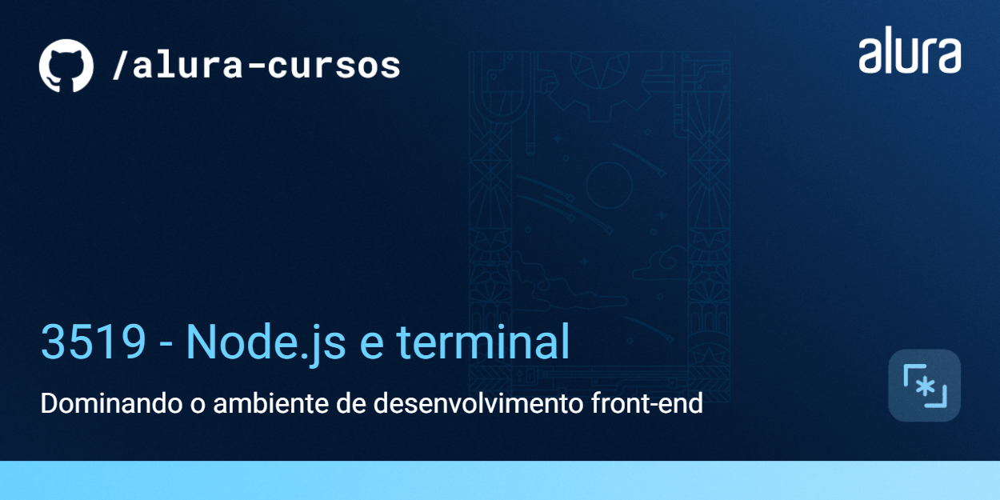

# VidFlow — Vite e consumo de API

Aplicação front-end de compartilhamento e descoberta de vídeos. Esta versão do VidFlow usa Vite para desenvolvimento local e Axios para consultar a API de vídeos.

## Funcionalidades

- Exibição de vídeos e navegação pela interface
- Consulta de dados com Axios
- API local simulada com JSON Server

## Tecnologias

JavaScript, Vite, Node.js, Axios, JSON Server, ESLint e Prettier.

## Como executar

Requer Node.js instalado.

```bash
npm install
npm run api-local
npm run dev
```

A aplicação fica disponível em `http://localhost:5173`. Para gerar a versão de produção, use `npm run build`.

## Demonstração

[Versão publicada](https://nodejs-vidflow-vite.vercel.app/)


## Links

- [Versão publicada](https://nodejs-vidflow-vite.vercel.app/)
- [Arquivo do projeto no Figma](https://www.figma.com/file/a0crwitCtGmNIQW0RVIs5H/VidFlow-%7C-Curso-Js---Consumindo-dados-de-uma-API?node-id=0%3A1&mode=dev)


